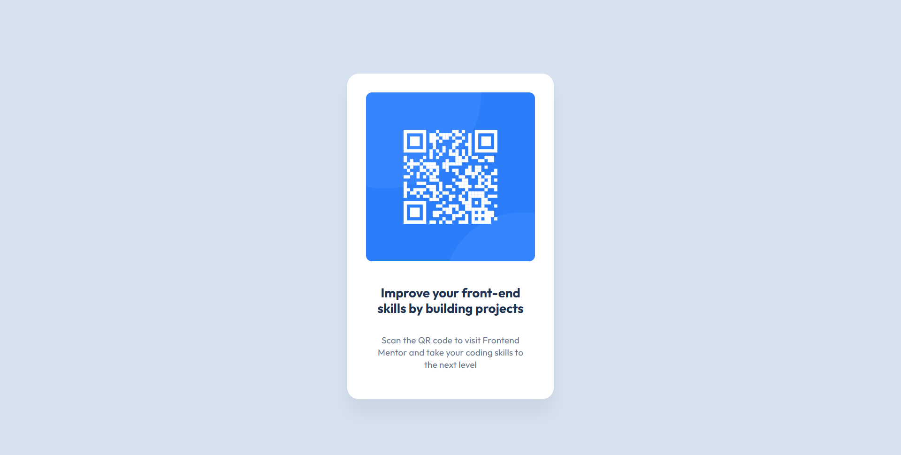

# Frontend Mentor - QR code component solution

This is a solution to the [QR code component challenge on Frontend Mentor](https://www.frontendmentor.io/challenges/qr-code-component-iux_sIO_H). Frontend Mentor challenges help you improve your coding skills by building realistic projects. 

## Table of contents

- [Overview](#overview)
  - [Screenshot](#screenshot)
  - [Links](#links)
- [My process](#my-process)
  - [Built with](#built-with)
  - [What I learned](#what-i-learned)
  - [Continued development](#continued-development)
- [Author](#author)


## Overview

### Screenshot




### Links

- Solution URL: [Add solution URL here](https://your-solution-url.com)
- Live Site URL: [Add live site URL here](https://desire4tech.github.io/Frontend-projects/)

## My process

### Built with

- Semantic HTML5 markup
- CSS custom properties
- Flexbox

### What I learned

I learned how to add shadow, how to make an item centered and responsive.

```css
.proud-of-this-css {
  display: flex;
    flex-direction: column;
    align-items: flex-start;
     box-shadow: 0px 25px 25px 0px rgba(0, 0, 0, 0.05);
}
```
### Continued development

I would still be interested in working with the display properties and box-shadow as well.

## Author

- Website - [Joy Effiong](https://desire4tech.github.io/Frontend-projects/)
- Frontend Mentor - [@Desire4tech](https://www.frontendmentor.io/profile/Desire4tech)
- Twitter - [@Clazzical_Joy](https://www.twitter.com/Clazzical_Joy)